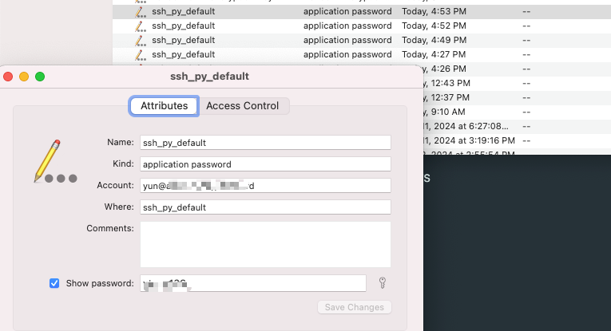

sshpky-zsh-plugin

====================

[oh-my-zsh plugin](https://github.com/robbyrussell/oh-my-zsh) for auto updating of git-repositories in $ZSH_CUSTOM folder

## Install

Create a new directory in `$ZSH_CUSTOM/plugins` called `autoupdate` and clone this repo into that directory. Note: it must be named `autoupdate` or oh-my-zsh won't recognize that it is a valid plugin directory.

```
git clone https://github.com/jeffzhangc/sshpky_zsh_plugin.git $ZSH_CUSTOM/plugins/sshpky
```

python3 is required

```
pip install keyring
pip install pexpect
```

## Usage

Add `sshpky` to the `plugins=()` list in your `~/.zshrc` file and you're done.

```bash
plugins=(sshpky)

# Multiple plugins should be separated by space character
# plugins=(somePlugin sshpky)
```

ssh remote host，use keyring to save password and auto input password from keychain;

如果 keychain 中没有找到密码，会提示输入，密码，登陆成功后，保存到 keychain

第二次登陆时，会从 keychain 中找密码

python3

```
pip install keyring
pip install pexpect
```



## reference

- [python sshpass](https://github.com/bdelliott/sshpass)
